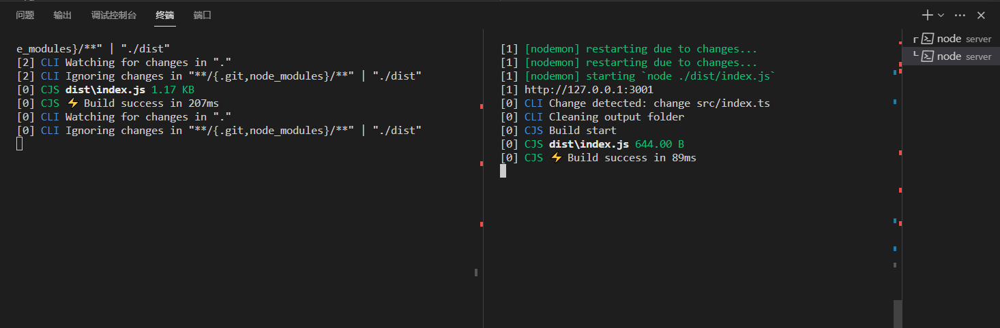

# 虚拟社团服务端

    node >= 18.18.2
    pnpm >= 8.6.5
    npx  >= 10.2.0

## 开发

    需要开启俩个终端

```git
# 终端一
# 热更新packages中的代码
pnpm watch:pak
```

```git
# 终端二
# 热更新server主目录
pnpm dev
```



## 打包

```git
pnpm build
# npx tsup 生成dist
# pnpm deploy 生成build (主要是将package)
# scripts/clearFiles.cjs 清理build中的多余文件
```

## 部署

```git
# 打包最新代码
pnpm build

cd build
# 打包镜像 注意版本号 :1.0.0
docker build -t xuni_shetuan:1.0.0
```
